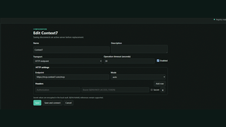
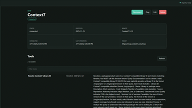
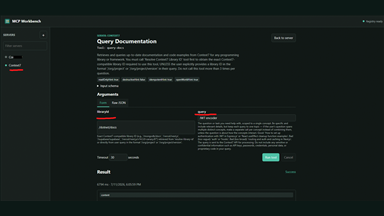
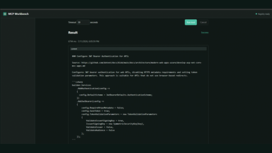

# MCP Workbench

MCP Workbench is a lightweight, self-hosted dashboard for testing Model Context Protocol
servers. Register local stdio or remote HTTP servers, inspect their tools, and invoke
tools manually without an LLM or model-provider account.

## Features

- Stdio and Streamable HTTP MCP transports
- Server connection, ping, and runtime inspection
- Tool discovery, schema inspection, and invocation
- Versioned local JSON registry
- Environment-based secret references
- Static browser UI and versioned HTTP API
- .NET 10 Native AOT publishing

## Screenshots

Click a thumbnail to view the full-size screenshot.

<p align="center">
  <a href="images/0.png"></a>
  <a href="images/1.png"></a>
  <a href="images/2.png"></a>
  <a href="images/3.png"></a>
</p>

## Quick Start

Requires the [.NET 10 SDK](https://dotnet.microsoft.com/download/dotnet/10.0).

```powershell
git clone https://github.com/andrii2g/mcp-workbench.git
cd mcp-workbench
dotnet restore McpWorkbench.slnx --force-evaluate
dotnet run --project src/McpWorkbench
```

Keep that terminal running, then open
[http://127.0.0.1:5070](http://127.0.0.1:5070).

For native executable, Docker, API-key, and first-server instructions, see the
[Quick Start guide](docs/QUICKSTART.md).

## Documentation

- [Quick Start](docs/QUICKSTART.md)
- [Configuration and persistence](docs/CONFIGURATION.md)
- [HTTP API](docs/API.md)
- [Architecture](docs/ARCHITECTURE.md)
- [MCP integration](docs/MCP-INTEGRATION.md)
- [Security](docs/SECURITY.md)
- [Native AOT](docs/NATIVE-AOT.md)
- [Testing](docs/TESTING.md)

Examples are available in [samples/servers.example.json](samples/servers.example.json)
and [requests/McpWorkbench.http](requests/McpWorkbench.http).

## License

Licensed under the [MIT License](LICENSE). Copyright (c) 2026 [andrii2g](https://github.com/andrii2g).
