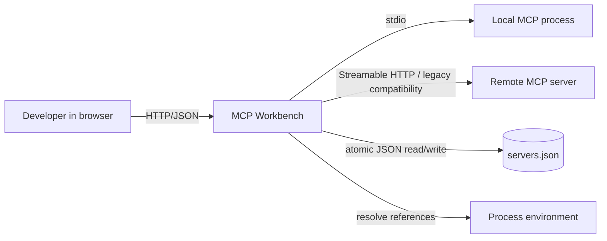
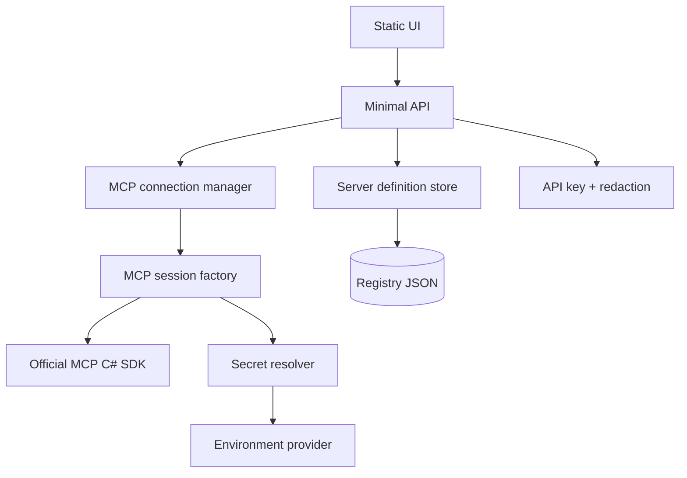
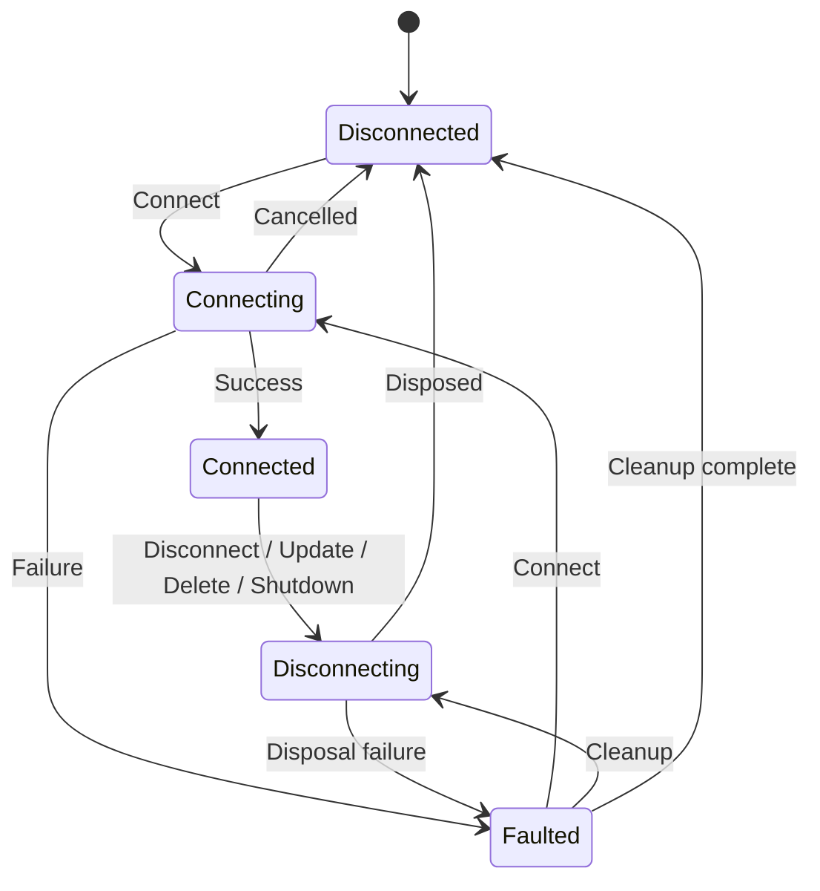
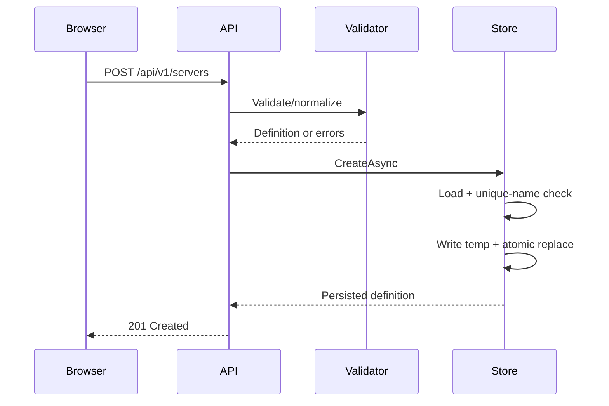
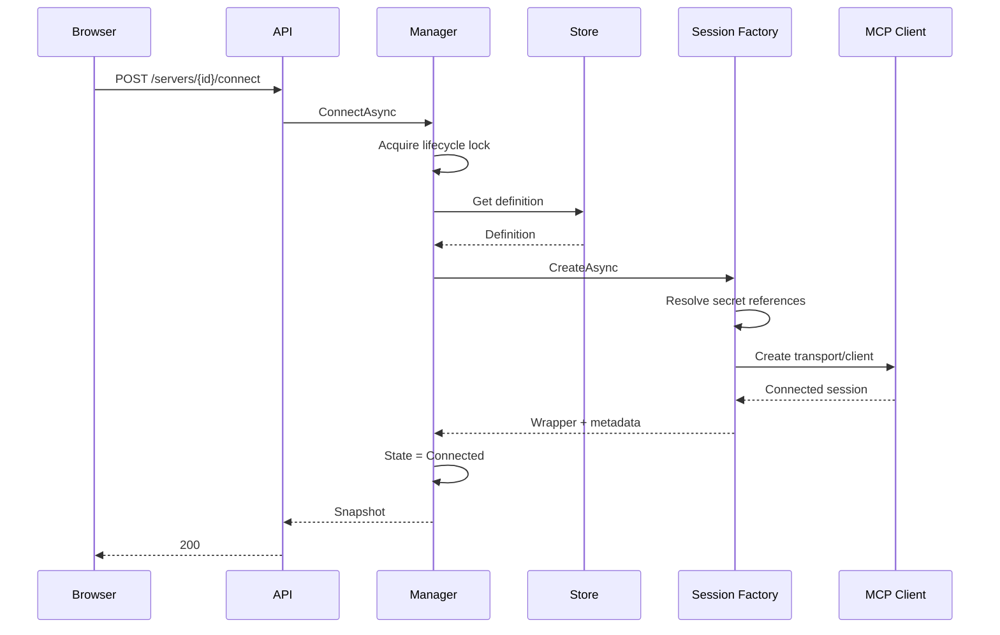
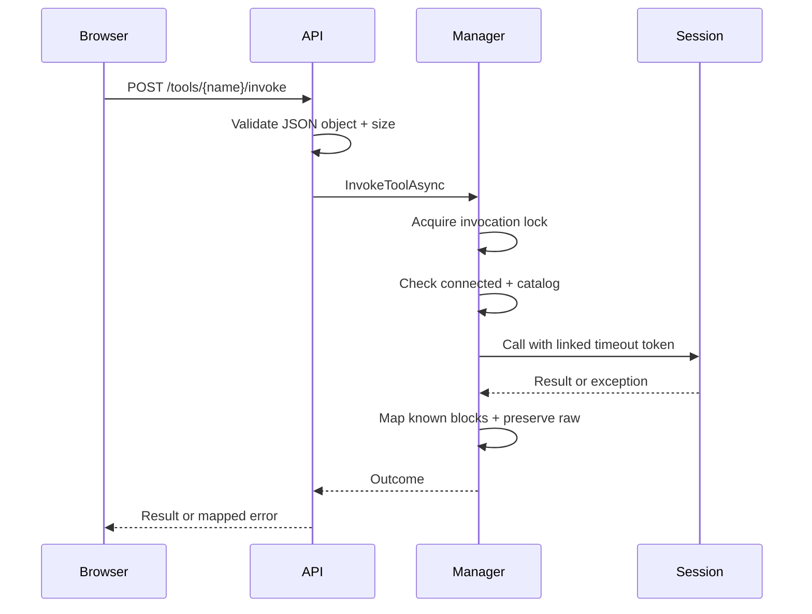

# Architecture

## 1. Context

MCP Workbench sits between a trusted developer and one or more MCP servers. It provides management and inspection functions but does not alter the MCP protocol or expose itself as an MCP server.



## 2. Container view

MCP Workbench is one deployable process:



The static UI and API share one origin, so the normal deployment needs no CORS configuration.

## 3. Component boundaries

### API

Responsibilities:

- route binding;
- request-size enforcement;
- request DTO validation entry point;
- cancellation propagation;
- response/error mapping;
- no SDK types in public responses.

### Definition store

Responsibilities:

- load and validate registry;
- enforce unique names;
- create/update/delete definitions;
- atomic persistence;
- refuse unsafe writes when registry is corrupt or unsupported.

It does not connect to MCP servers.

### Connection manager

Responsibilities:

- own runtime entries;
- coordinate lifecycle transitions;
- invoke the session factory;
- cache tool catalogs;
- serialize calls per server;
- dispose sessions on update, delete, or shutdown.

### MCP session factory and wrapper

Responsibilities:

- convert validated definitions into SDK transport options;
- resolve environment references into ephemeral configuration;
- create SDK clients;
- expose ping/list/call/metadata/disposal;
- normalize SDK exceptions.

No other component uses SDK client or protocol types directly.

### Static UI

Responsibilities:

- present definitions and runtime state;
- invoke management endpoints;
- validate raw JSON syntax;
- build a limited schema form;
- render results safely.

The UI is not a security boundary. Server validation is authoritative.

## 4. Persisted versus runtime state

### Persisted

- server ID;
- name and description;
- transport kind;
- stdio or HTTP settings;
- timeout settings;
- unresolved `${ENV:NAME}` references;
- created/updated timestamps;
- registry schema version.

### Runtime only

- SDK client/session;
- transport instance;
- child process/process ID;
- connection state;
- negotiated metadata;
- last connection error;
- connected timestamp;
- cached tool catalog;
- active cancellation tokens;
- semaphores.

Runtime objects are never serialized.

## 5. Runtime state machine



Invariants:

- `Connected` requires a non-null live session.
- `Disconnected` requires null session and empty tool cache.
- `Faulted` may carry a sanitized error but must not retain a partially initialized client.
- only the per-server lifecycle semaphore changes state.

## 6. Concurrency model

### Runtime dictionary

```text
ConcurrentDictionary<Guid, McpServerRuntime>
```

The dictionary protects entry lookup/creation, not internal state.

### Lifecycle semaphore

One `SemaphoreSlim(1, 1)` per runtime serializes connect, disconnect, replacement, and cleanup. It may be held during I/O because it blocks only that server.

### Invocation semaphore

A separate `SemaphoreSlim(1, 1)` serializes tool invocation for the same server. Different servers can run concurrently.

### Store semaphore

One persistence semaphore serializes initialization and writes. Never hold it while waiting for MCP network/process I/O.

### Update/delete coordination

1. validate request;
2. enter runtime lifecycle path;
3. disconnect existing runtime;
4. update/delete persistence;
5. reset/remove runtime entry;
6. return current representation.

If persistence fails after disconnect, the old definition remains persisted but disconnected.

## 7. Create flow



Creating a definition never starts a process or contacts a remote endpoint.

## 8. Connect flow



The operation observes both request cancellation and a configured connection timeout.

## 9. Tool discovery

`GET /tools`:

- connected + cache exists: return cache;
- connected + no cache: load once;
- disconnected: `409 server_not_connected`.

`POST /tools/refresh` always reloads while connected.

Reconnect, update, delete, and disconnect clear the cache.

## 10. Invocation flow



A result with `isError = true` is a successful MCP exchange and returns HTTP 200 with `toolError = true`. Protocol/transport failures return non-2xx.

## 11. Startup/readiness

Startup:

1. bind/validate options;
2. register services and generated JSON metadata;
3. ensure data directory;
4. load or initialize registry;
5. map API/static files;
6. listen.

`/health/live` means process/HTTP pipeline alive.

`/health/ready` means configuration valid and registry readable. Configured MCP servers do not need to be online.

## 12. Shutdown

On host stopping, call `DisconnectAllAsync` with a bounded timeout. Sanitize failures. Continue shutdown after timeout so one unresponsive process cannot block termination forever.

## 13. Failure mapping

- validation: 400;
- missing server/tool: 404;
- name conflict or invalid lifecycle state: 409;
- request too large: 413;
- connection/protocol failures: 502;
- timeout: 504;
- registry unavailable/corrupt: 503;
- unexpected: 500 with trace ID.

Client disconnect cancellation must not be misreported as an internal failure.

## 14. Architectural exclusions

### No class-library onion architecture

One deployable service does not justify multiple production assemblies. Folder boundaries and narrow interfaces are sufficient.

### No Blazor

Blazor Server is unsuitable for the Native AOT requirement; standalone WebAssembly adds a second application and larger distribution.

### No database

Single-instance administrative data is small. Atomic JSON is simpler and auditable.

### No automatic reconnect

It could repeatedly start broken processes and hide configuration errors. Reconnect is explicit.

### No persistent invocation history

Tool payloads may contain secrets. Avoiding persistence is simpler and safer.
